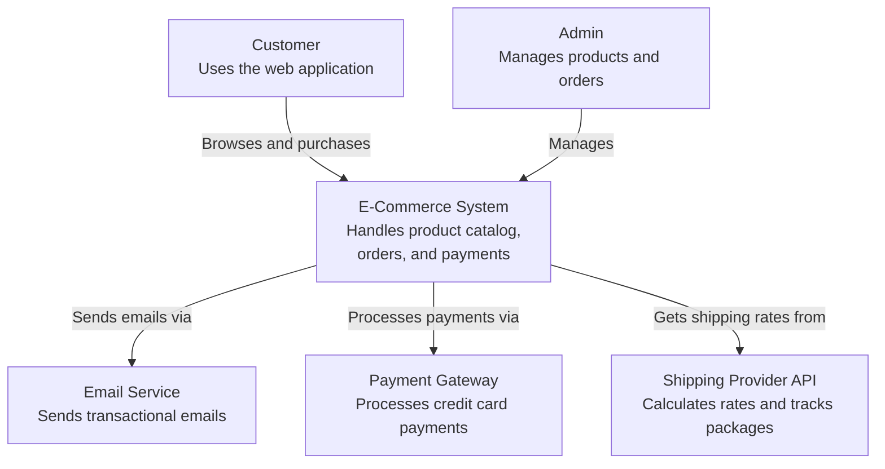
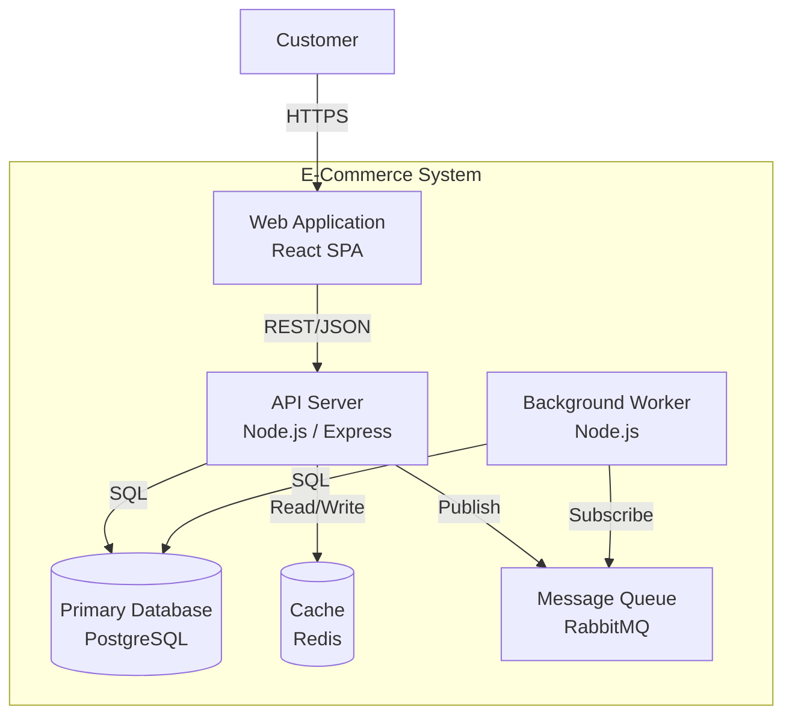

# Architecture Documentation Standards

## 1. Why Architecture Documentation Matters

### The Fundamental Problem

The best architecture in the world is worthless if no one understands it. A brilliant
design locked inside one person's head is a liability, not an asset. When that person
goes on vacation, changes teams, or leaves the company, the architecture leaves with
them. What remains is code that works for reasons nobody can articulate, shaped by
constraints nobody remembers.

### Documentation as Institutional Memory

People leave. Decisions stay. Every software system accumulates hundreds of architectural
decisions over its lifetime: why this database instead of that one, why the system is
split into these services and not those, why a particular protocol was chosen, why a
simpler approach was rejected. Without documentation, each of these decisions becomes
an archaeological mystery for the next engineer.

Institutional memory is not optional. It is the difference between a team that learns
from its past and a team that endlessly re-discovers the same lessons.

### The Cost of Undocumented Decisions

Undocumented architecture creates three categories of waste:

**Re-litigation.** The same decision gets debated every six months because nobody
remembers that it was already made, or why. Teams burn hours in meetings arguing over
a choice that was settled a year ago with good reasons that are now forgotten.

**Context switching tax.** Every new team member must reconstruct the "why" behind the
system by reading code, asking colleagues, and making guesses. This onboarding tax
compounds as the system grows more complex.

**Repeated mistakes.** Without a record of what was tried and what failed, teams walk
into the same traps. An approach that was rejected two years ago for good reasons gets
proposed again because nobody documented those reasons.

### What Planner Produces

As an architecture agent, Planner creates several classes of documents:

| Document Type | Purpose | Audience | Lifespan |
|---------------|---------|----------|----------|
| **Blueprint** | High-level system design and project plan | All stakeholders | Project lifetime |
| **ADR** | Record of a single architecture decision | Engineering team | Permanent |
| **RFC** | Proposal for discussion before a decision is made | Engineering + stakeholders | Until decided |
| **Technical Spec** | Detailed implementation plan for a feature/system | Engineering team | Until implemented |
| **Trade-off Analysis** | Comparison of competing approaches | Decision makers | Until decision is made |

Each document type serves a different purpose at a different stage of the design process.
Choosing the right format is itself an architectural skill.

---

## 2. Architecture Decision Records (ADRs)

### What They Are

An Architecture Decision Record is a short document that captures ONE significant
architecture decision. Not a design document. Not a spec. One decision, captured in
a way that future engineers can understand what was decided, why, and what the
consequences are.

The concept was popularized by Michael Nygard and has become an industry standard
for recording architectural choices.

### When to Write an ADR

Write an ADR when a decision meets any of these criteria:

- **Hard to reverse.** Choosing a database, a programming language, a communication
  protocol, or a deployment model.
- **Affects multiple teams or components.** Authentication strategy, API versioning
  scheme, data serialization format.
- **Involves significant trade-offs.** Performance vs. simplicity, consistency vs.
  availability, build vs. buy.
- **Will be questioned later.** If you can imagine someone asking "why did we do it
  this way?" in six months, write an ADR now.

Do NOT write an ADR for:

- Routine coding decisions (variable names, minor refactors)
- Decisions that are trivially reversible
- Decisions that affect only one file or one function
- Team process decisions (use a different format for those)

### Standard ADR Template (Michael Nygard Format)

```markdown
# ADR-NNNN: [Short Noun Phrase Describing the Decision]

## Status

[Proposed | Accepted | Deprecated | Superseded by ADR-XXXX]

## Context

[What is the issue that we are seeing that is motivating this decision or change?
Describe the forces at play: technical constraints, business requirements,
team capabilities, time pressure. Be factual and specific.]

## Decision

[What is the change that we are proposing and/or doing?
State the decision clearly and directly. Use active voice:
"We will use X" not "X was chosen."]

## Consequences

[What becomes easier or more difficult to do because of this change?
List positive, negative, and neutral consequences. Be honest about downsides.
Every decision has trade-offs — if you cannot list any negative consequences,
you have not thought hard enough.]
```

### Extended ADR Template

For decisions that benefit from more structure, add these fields:

```markdown
# ADR-NNNN: [Short Noun Phrase Describing the Decision]

## Status

[Proposed | Accepted | Deprecated | Superseded by ADR-XXXX]

## Date

[YYYY-MM-DD]

## Decision Makers

[Who was involved in making this decision]

## Context

[Forces, constraints, requirements driving this decision]

## Decision

[What we decided]

## Alternatives Considered

### Alternative A: [Name]
- **Description:** [Brief description]
- **Pros:** [What is good about this approach]
- **Cons:** [What is bad about this approach]
- **Why rejected:** [Specific reason this was not chosen]

### Alternative B: [Name]
- **Description:** [Brief description]
- **Pros:** [What is good about this approach]
- **Cons:** [What is bad about this approach]
- **Why rejected:** [Specific reason this was not chosen]

## Consequences

### Positive
- [Benefit 1]
- [Benefit 2]

### Negative
- [Drawback 1]
- [Drawback 2]

### Neutral
- [Side effect that is neither good nor bad]

## Risks

- [Risk 1 and mitigation]
- [Risk 2 and mitigation]

## Follow-Up Actions

- [ ] [Action needed to implement this decision]
- [ ] [Another action needed]

## References

- [Link to related ADRs, RFCs, or external resources]
```

### ADR Numbering and Organization

ADRs should be:

- **Sequentially numbered.** `ADR-0001`, `ADR-0002`, etc. Never reuse a number.
- **Stored in a known location.** Conventionally `/docs/adr/` in the repository root.
- **Indexed.** Maintain a `README.md` or `index.md` in the ADR directory that lists
  all ADRs with their titles and statuses.
- **Version controlled.** ADRs live in the same repository as the code they describe.
  They are reviewed in pull requests like any other change.

Example directory structure:

```
docs/
  adr/
    index.md
    0001-use-postgresql-for-primary-database.md
    0002-adopt-event-driven-architecture.md
    0003-choose-rest-over-grpc-for-public-api.md
    0004-use-terraform-for-infrastructure.md
```

Example index file:

```markdown
# Architecture Decision Records

| ADR | Title | Status | Date |
|-----|-------|--------|------|
| 0001 | Use PostgreSQL for Primary Database | Accepted | 2025-01-15 |
| 0002 | Adopt Event-Driven Architecture | Accepted | 2025-02-03 |
| 0003 | Choose REST over gRPC for Public API | Accepted | 2025-02-20 |
| 0004 | Use Terraform for Infrastructure | Proposed | 2025-03-01 |
```

### ADR Status Lifecycle

```
Proposed --> Accepted --> [lives on as permanent record]
    |                          |
    +--> Rejected              +--> Deprecated
                               |
                               +--> Superseded by ADR-XXXX
```

- **Proposed:** Under review, not yet decided.
- **Accepted:** Decision is in effect.
- **Deprecated:** Decision is no longer relevant (system was decommissioned, etc.).
- **Superseded:** A newer ADR replaces this one. Link to the replacement.

Important: Never delete ADRs. Even rejected or superseded ADRs are part of the
historical record. They prevent re-litigation.

### Real-World ADR Example

```markdown
# ADR-0003: Choose REST over gRPC for Public API

## Status

Accepted

## Date

2025-02-20

## Context

We need to expose a public API for third-party integrations. Our internal services
currently communicate over gRPC, which has served us well for service-to-service
calls. However, for the public-facing API we must consider:

- Developer experience for third-party consumers who may not use gRPC
- Browser compatibility requirements for web-based clients
- The need for human-readable request/response debugging
- Our existing internal API gateway supports both REST and gRPC
- Our documentation tooling generates OpenAPI specs natively

## Decision

We will use REST (HTTP/JSON) for the public-facing API. Internal service-to-service
communication will continue to use gRPC.

## Alternatives Considered

### gRPC for public API
- **Pros:** Type safety via protobuf, efficient binary protocol, streaming support
- **Cons:** Poor browser support without grpc-web proxy, higher barrier for
  third-party developers, harder to debug with standard HTTP tools
- **Why rejected:** Developer experience for external consumers is our top priority

### GraphQL for public API
- **Pros:** Flexible querying, reduces over-fetching, strong typing
- **Cons:** Caching complexity, potential for expensive queries without careful
  rate limiting, steeper learning curve for consumers
- **Why rejected:** Added complexity not justified for our use case; our resources
  have stable, well-defined shapes

## Consequences

### Positive
- Third-party developers can integrate using any HTTP client
- Standard tooling (curl, Postman, browser) works out of the box
- OpenAPI spec generation gives us automatic documentation
- Wide ecosystem of REST client libraries in every language

### Negative
- No streaming support for real-time updates (will need WebSocket or SSE separately)
- Larger payload sizes compared to protobuf
- Must maintain two API styles (REST public, gRPC internal)

### Neutral
- Will need an API gateway layer to translate between REST and internal gRPC services
```

### ADR Anti-Patterns

**Written after the fact.** An ADR written months after a decision was made is better
than nothing, but it often suffers from revisionist history. Write ADRs at the time
the decision is made, when the reasoning is fresh.

**No consequences listed.** If the consequences section is empty or lists only positive
outcomes, the ADR is not honest. Every decision has trade-offs. Document them.

**Too long.** An ADR is not a design document. It should be 1-2 pages maximum. If you
need more space, you need a technical spec, not an ADR.

**Too vague.** "We decided to use a modern framework" is not a decision. Be specific:
name the technology, the version, the scope of the decision.

**Decisions by committee without a decider.** ADRs should record WHO made the final
call. Consensus is nice when achievable, but someone owns the decision.

---

## 3. RFCs (Request for Comments)

### When to Use RFC vs ADR

The distinction is simple:

- **RFC:** A *proposal* that needs team discussion BEFORE a decision is made.
  The outcome is uncertain. Multiple approaches are viable. You need input.
- **ADR:** A *record* of a decision that has been made (or is being made by the
  author with documented reasoning). The outcome is clear.

In practice, many RFCs produce one or more ADRs. The RFC is the conversation; the ADR
is the conclusion.

Use an RFC when:

- The change is large enough that multiple people should review the approach
- There is genuine uncertainty about the right path
- The decision will affect people who are not in the room
- You want to solicit alternatives you may not have considered

### RFC Template

```markdown
# RFC: [Descriptive Title]

**Author:** [Name]
**Status:** Draft | In Review | Accepted | Rejected | Withdrawn
**Created:** [YYYY-MM-DD]
**Review Deadline:** [YYYY-MM-DD]

---

## Summary

[One paragraph. What is being proposed and why. A busy reader should understand the
core idea from this paragraph alone.]

## Motivation

[Why is this change needed? What problem does it solve? What use cases does it
enable? What happens if we do NOT make this change?]

## Detailed Design

[Technical details of the proposed approach. Include:
- System architecture changes
- Data model changes
- API changes
- Sequence diagrams where helpful
- Key implementation details

This section should be detailed enough that someone could implement the proposal
based on this description, though some details can be left to the implementation
phase.]

## Alternatives Considered

### Alternative A: [Name]
[Description and analysis. Why this was not the preferred approach.]

### Alternative B: [Name]
[Description and analysis. Why this was not the preferred approach.]

## Drawbacks and Risks

[What are the downsides of this approach? What could go wrong?
Be thorough and honest. Common categories:
- Performance implications
- Operational complexity
- Migration risk
- Learning curve
- Dependencies on external systems]

## Open Questions

[Things that are not yet decided or need more investigation.
Number them for easy reference in discussions.]

1. [Question 1]
2. [Question 2]
3. [Question 3]

## Future Possibilities

[Optional. What does this enable in the future? How might this design
evolve? This section is explicitly NOT part of the current proposal
but shows how the design accommodates future needs.]
```

### RFC Workflow

```
  Author writes Draft
         |
         v
  Draft circulated for review (async)
         |
         v
  Review period (5 business days default)
         |
    +----+----+
    |         |
    v         v
 Consensus   Disagreements
    |         |
    v         v
 Accepted    Sync discussion (meeting)
              |
         +----+----+
         |         |
         v         v
      Accepted   Rejected/Revised
                    |
                    v
              New draft, repeat
```

### Time-Boxing RFC Reviews

RFC reviews MUST be time-boxed. Without a deadline, RFCs languish in limbo indefinitely.

Recommended defaults:

| RFC Scope | Review Period |
|-----------|---------------|
| Small (one team, limited blast radius) | 3 business days |
| Medium (cross-team, moderate impact) | 5 business days |
| Large (organization-wide, major architecture change) | 10 business days |

Rules:

- The deadline is stated in the RFC header.
- Silence is consent. If a reviewer does not comment by the deadline, their
  approval is assumed.
- The author may extend the deadline once if substantive feedback is still incoming.
- After the deadline, the author publishes a decision (Accepted, Rejected, or Revised).

### Running a Good RFC Review

**Async first.** Most RFC feedback should be written comments on the document. This
lets reviewers engage on their own schedule and produces a written record of the
discussion.

**Sync only for disagreements.** Schedule a meeting only when there is a substantive
disagreement that cannot be resolved in written comments. The meeting should focus
exclusively on the disputed points, not re-read the entire RFC.

**Separate concerns.** Distinguish between:

- **Blocking concerns:** "This will cause data loss" — must be resolved before acceptance
- **Non-blocking concerns:** "I would prefer a different naming convention" — noted, author decides
- **Questions:** "How does this handle edge case X?" — author responds, may update RFC

**Number your comments.** Reference specific sections. "In the Detailed Design section,
paragraph 3..." is more useful than "I have a concern about the design."

**Author responsibilities:**

- Respond to every blocking concern
- Update the RFC to address feedback (or explain why not)
- Publish a summary of changes after each revision
- Make the final decision and publish it

---

## 4. Technical Specifications

### What They Are

A technical specification is a detailed implementation plan for a specific feature,
system, or subsystem. Unlike an ADR (one decision) or an RFC (a proposal for discussion),
a spec is a comprehensive plan that covers everything an engineering team needs to build
the thing.

Specs are the bridge between architecture and implementation.

### Technical Spec Template

```markdown
# Technical Specification: [Feature/System Name]

**Author:** [Name]
**Status:** Draft | In Review | Approved | Implementing | Complete
**Created:** [YYYY-MM-DD]
**Last Updated:** [YYYY-MM-DD]
**Reviewers:** [Names]

---

## 1. Overview

[2-3 paragraphs. What is being built, why, and for whom.
Include the core user story or business requirement.]

## 2. Goals

- [Goal 1: measurable, specific]
- [Goal 2: measurable, specific]
- [Goal 3: measurable, specific]

## 3. Non-Goals

[Explicitly state what this spec does NOT cover. This is as important as
the goals. Non-goals prevent scope creep and set clear expectations.]

- [Non-goal 1: what we are deliberately not doing and why]
- [Non-goal 2: what we are deliberately not doing and why]

## 4. Background and Context

[What existing systems, decisions, or constraints does the reader need to
understand? Link to relevant ADRs, previous specs, or external documentation.]

## 5. Detailed Design

### 5.1 System Architecture

[High-level architecture diagram. Show major components and their
relationships. Use C4 Level 2 (Container) or Level 3 (Component).]

### 5.2 Data Model

[Database schema changes, new tables/collections, data flow.
Include entity-relationship diagrams where helpful.]

### 5.3 API Design

[API contracts: endpoints, request/response formats, error codes.
For internal APIs, include protobuf definitions or interface specifications.]

### 5.4 Key Algorithms or Logic

[Any non-obvious business logic, algorithms, or processing pipelines.
Pseudocode is fine. Focus on what is hard or surprising.]

### 5.5 Security Considerations

[Authentication, authorization, data encryption, input validation,
rate limiting. How does this feature handle malicious input?]

## 6. Testing Strategy

[How will this be tested?]

- **Unit tests:** [What will be unit tested]
- **Integration tests:** [What integration points will be tested]
- **End-to-end tests:** [Key user flows to validate]
- **Performance tests:** [Load/stress testing plan if applicable]
- **Manual testing:** [Anything that requires human verification]

## 7. Rollout Plan

[How will this be deployed?]

- **Feature flags:** [Will this be behind a flag?]
- **Phased rollout:** [Percentage rollout plan]
- **Rollback plan:** [How to undo if something goes wrong]
- **Data migration:** [Any data migration steps needed]

## 8. Monitoring and Alerting

[How will we know if this is working correctly in production?]

- **Key metrics:** [What to measure]
- **Dashboards:** [What to visualize]
- **Alerts:** [What conditions trigger alerts and who gets paged]
- **Logging:** [What to log for debugging]

## 9. Open Questions

[Unresolved issues that need answers before or during implementation.]

1. [Question 1]
2. [Question 2]

## 10. Timeline and Milestones

[Rough implementation timeline. Not a commitment, but a plan.]

| Milestone | Target Date | Description |
|-----------|-------------|-------------|
| M1 | [Date] | [What is delivered] |
| M2 | [Date] | [What is delivered] |
| M3 | [Date] | [What is delivered] |

## Appendix

[Supporting material: detailed diagrams, data samples, research links,
related ADRs, prior art.]
```

### Specs vs Blueprints

In the Planner context:

- A **blueprint** is a high-level project plan: what are we building, why, what is the
  overall architecture, what are the major milestones. Blueprints are for stakeholders
  and the full team.
- A **spec** is a detailed implementation plan for one piece of the blueprint: exactly
  how this service works, what the API looks like, how data flows. Specs are for the
  engineering team building that piece.

One blueprint may generate multiple specs. The blueprint says "we need an authentication
service." The spec says exactly how that authentication service works.

---

## 5. C4 Model for Architecture Diagrams

### Overview

The C4 model, created by Simon Brown, provides a hierarchical way to describe software
architecture at four levels of detail. Think of it like zooming in on a map: from
country level down to street level.

### Level 1: System Context Diagram

**What it shows:** Your system as a single box, surrounded by the users and external
systems it interacts with.

**When to use:** Always. Every system should have a context diagram. It is the starting
point for any architecture conversation.

**What to include:**

- Your system (one box)
- Users/personas (stick figures or boxes)
- External systems your system depends on or integrates with
- Arrows showing relationships, labeled with the nature of the interaction

**Example (Mermaid syntax):**



### Level 2: Container Diagram

**What it shows:** The high-level technical building blocks inside your system:
applications, databases, message queues, file stores.

**When to use:** For any system that has more than one deployable unit or data store.
Most systems need this diagram.

**What to include:**

- Each "container" (web app, API server, database, message queue, etc.)
- Technology choices labeled on each container
- Communication protocols between containers
- External systems from Level 1 shown as simplified boxes at the boundary

**Example (Mermaid syntax):**



### Level 3: Component Diagram

**What it shows:** The major structural pieces inside a single container. For example,
the key modules, services, or layers within your API server.

**When to use:** When a container is complex enough that its internal structure needs
to be communicated. Not every container needs a component diagram.

**What to include:**

- Major components/modules within the container
- Their responsibilities (brief description)
- Dependencies between components
- Which components interact with external containers

### Level 4: Code Diagram

**What it shows:** Class diagrams, function call graphs, or entity-relationship
diagrams at the code level.

**When to use:** Rarely. Only for particularly complex algorithms, data models, or
when onboarding someone to a critical subsystem. Most of the time, the code itself
is the best documentation at this level.

### Choosing the Right Level

| Audience | Recommended Level |
|----------|-------------------|
| Executives, product managers, non-technical stakeholders | Level 1 (System Context) |
| Development team, DevOps, new engineers onboarding | Level 2 (Container) |
| Team working on a specific service/application | Level 3 (Component) |
| Debugging or understanding critical algorithms | Level 4 (Code) |

### Diagramming Tools

| Tool | Format | Best For |
|------|--------|----------|
| **Mermaid** | Text (Markdown-embeddable) | Quick diagrams in docs, version-controlled |
| **PlantUML** | Text (requires renderer) | Detailed UML diagrams, sequence diagrams |
| **Structurizr** | Code (DSL or API) | C4 model specifically, maintains model consistency |
| **draw.io / diagrams.net** | Visual editor (XML storage) | Ad-hoc diagrams, non-technical stakeholders |
| **Excalidraw** | Visual editor (JSON storage) | Informal whiteboard-style sketches |

For architecture documentation that lives alongside code, text-based tools (Mermaid,
PlantUML, Structurizr DSL) are preferred because they can be version-controlled,
diffed, and reviewed in pull requests.

### Diagram Anti-Patterns

**Too many boxes.** If a diagram has more than 15-20 elements, it is trying to show
too much at once. Break it into multiple diagrams at different C4 levels.

**Unlabeled connections.** Every arrow should be labeled with what flows along it:
"REST/JSON," "SQL queries," "publishes events," "reads from." An arrow without a
label is ambiguous.

**Mixed abstraction levels.** Do not put a database, a microservice, a class, and a
function in the same diagram. Each diagram should operate at one C4 level.

**Missing legend.** If the diagram uses colors, shapes, or line styles to convey
meaning, include a legend. Do not assume the reader knows your conventions.

**Diagrams as decoration.** A diagram that does not help the reader understand
something they could not understand from text alone is wasting space. Every diagram
should answer a specific question.

---

## 6. Trade-Off Documentation

### Why Document Trade-Offs

Every architectural decision involves trade-offs. Documenting them serves two purposes:

1. **Forces rigorous thinking.** Writing down trade-offs reveals gaps in analysis.
   If you cannot articulate the downside of your preferred option, you do not
   understand it well enough.
2. **Enables future re-evaluation.** When circumstances change (new requirements,
   new technology, new scale), documented trade-offs allow the team to revisit
   decisions with the original reasoning intact.

### Decision Matrix Format

A decision matrix is a structured way to compare multiple options against defined
criteria. It replaces "gut feeling" with transparent, debatable reasoning.

```markdown
## Decision: [What we are deciding]

### Criteria

| # | Criterion | Weight | Description |
|---|-----------|--------|-------------|
| 1 | Performance | 5 | Must handle 10,000 requests/second |
| 2 | Operational Complexity | 4 | Team must be able to maintain it |
| 3 | Cost | 3 | Infrastructure and licensing cost |
| 4 | Developer Experience | 3 | Learning curve and tooling quality |
| 5 | Community/Ecosystem | 2 | Availability of libraries and support |

### Scoring (1-5, where 5 is best)

| Criterion | Weight | Option A | Option B | Option C |
|-----------|--------|----------|----------|----------|
| Performance | 5 | 4 (20) | 5 (25) | 3 (15) |
| Operational Complexity | 4 | 3 (12) | 2 (8) | 5 (20) |
| Cost | 3 | 4 (12) | 2 (6) | 5 (15) |
| Developer Experience | 3 | 5 (15) | 3 (9) | 4 (12) |
| Community/Ecosystem | 2 | 5 (10) | 4 (8) | 3 (6) |
| **Total** | | **69** | **56** | **68** |

### Analysis

[Interpret the scores. The highest score is not always the right answer.
Discuss any criteria where the difference is particularly significant.
Note any criteria that are pass/fail rather than scored.]

### Recommendation

[State the recommendation with reasoning. Reference the matrix but do not
hide behind it — the matrix is an input to the decision, not the decision itself.]
```

### Weighted Scoring

Weights reflect priority. A weight of 5 means "this criterion is critical" while a
weight of 1 means "nice to have." Guidelines for setting weights:

- Weights should be set BEFORE scoring options (to avoid biasing weights toward a
  preferred option)
- The team or decision maker should agree on weights before evaluating options
- Use a 1-5 scale for weights to keep the math simple
- Document WHY each weight was chosen

### Reversibility as a Key Dimension

Not all decisions carry equal risk. A decision that can be easily undone (a "two-way
door") deserves less deliberation than a decision that is permanent or very expensive
to reverse (a "one-way door").

**One-way door decisions** (hard or impossible to reverse):

- Choosing a primary programming language
- Selecting a database engine for production data
- Defining a public API contract that external clients depend on
- Choosing a cloud provider for core infrastructure
- Open-sourcing proprietary code

**Two-way door decisions** (easily reversible):

- Choosing an internal library or framework
- Selecting a CI/CD tool
- Deciding on a code formatting standard
- Choosing a logging framework
- Picking an internal communication protocol between two services you control

### The Bezos Framework

Jeff Bezos articulated this distinction as Type 1 and Type 2 decisions:

**Type 1 (one-way door):** These decisions are consequential and irreversible or
nearly irreversible. They should be made methodically, carefully, slowly, with great
deliberation and consultation. Use RFCs, ADRs, decision matrices, and broad review.

**Type 2 (two-way door):** These decisions are changeable and reversible. They should
be made quickly by individuals or small groups with high judgment. Over-deliberating
Type 2 decisions slows the organization down.

The architectural skill is in correctly classifying which type a decision is. Most
decisions are Type 2, but organizations often treat them all as Type 1.

### Trade-Off Documentation Template

```markdown
# Trade-Off Analysis: [Decision Title]

## Date
[YYYY-MM-DD]

## Decision Type
[One-way door | Two-way door]

## Context
[What prompted this analysis]

## Options

### Option 1: [Name]
**Description:** [How this option works]
**Strengths:**
- [Strength 1]
- [Strength 2]
**Weaknesses:**
- [Weakness 1]
- [Weakness 2]
**Estimated Effort:** [T-shirt size: S/M/L/XL]
**Reversibility:** [Easy / Moderate / Difficult / Irreversible]

### Option 2: [Name]
[Same structure as above]

### Option 3: [Name]
[Same structure as above]

## Decision Matrix
[Use weighted scoring table from above]

## Recommendation
[State the recommended option and the primary reasons why.
Acknowledge what is being given up by not choosing the alternatives.]

## Follow-Up
[What needs to happen next. Link to the ADR that will record the final decision.]
```

---

## 7. Documentation Anti-Patterns

### Writing Docs Nobody Reads

**Symptom:** Documents exist, but engineers consistently say "I didn't know that was
documented" or "where is that doc?"

**Root causes:**

- **Wrong location.** Documentation must live where engineers already look. For code
  decisions, that means the code repository. Not a wiki. Not a shared drive. Not an
  email thread.
- **Wrong audience.** A document written for executives will not help engineers, and
  vice versa. Know your reader.
- **Too long.** A 30-page design document will not be read. If a document must be long,
  provide an executive summary at the top.
- **No entry point.** If there is no index, no table of contents, no "start here"
  document, newcomers cannot find anything.

**Fix:** Put docs next to code. Keep them short. Include a README that serves as a
table of contents. Link from code comments to relevant ADRs.

### Documentation That Rots

**Symptom:** Documents describe a system that no longer exists, or include details
that are now incorrect.

**Root causes:**

- **No owner.** Every document needs a named owner who is responsible for keeping it
  current. "The team" is not an owner.
- **No review cycle.** Documents should be reviewed periodically (quarterly for
  active systems) and updated or marked as stale.
- **Coupled to volatile details.** Documents that include specific IP addresses,
  version numbers, or configuration values rot fastest. Reference these from
  documents rather than embedding them.

**Fix:** Assign owners. Schedule quarterly reviews. Prefer linking to source-of-truth
configurations over embedding values. Add "Last Reviewed" dates to every document.

### Spec Fiction

**Symptom:** A beautifully written specification describes a system in exquisite
detail. The actual system bears no resemblance to the spec.

**Root causes:**

- Spec was written before implementation and never updated as reality diverged
- Spec was aspirational rather than descriptive
- No one checked whether the implementation matched the spec

**Fix:** Update specs during implementation. Treat spec-reality divergence as a bug.
After implementation, add a note: "Implementation complete — this spec now describes
the system as built." Consider specs living documents during active development.

### Over-Documentation

**Symptom:** Every trivial decision has an ADR. Every function has a design document.
The volume of documentation is so high that nothing is findable.

**Root causes:**

- Confusing thoroughness with usefulness
- Mandate to "document everything" without guidance on what matters
- Fear that undocumented decisions will be questioned

**Fix:** Apply the "will someone ask why?" test. If a decision is obvious, routine,
or trivially reversible, it does not need an ADR. If a function's purpose is clear
from its name and a one-line comment, it does not need a design document.

The goal is not maximum documentation. The goal is sufficient documentation:
enough that important decisions are recorded and the system's architecture can be
understood, but not so much that the documentation itself becomes a maintenance burden.

### Wiki Sprawl

**Symptom:** Documents are scattered across multiple wikis, shared drives, Slack
threads, email chains, and individual notebooks. No one knows where to find anything.

**Root causes:**

- No agreed-upon location for documentation
- Multiple tools used for the same purpose
- No indexing or navigation structure

**Fix:** Establish a single source of truth for each category of document:

| Document Type | Location |
|---------------|----------|
| ADRs | Repository: `/docs/adr/` |
| Technical Specs | Repository: `/docs/specs/` |
| RFCs | Repository: `/docs/rfc/` or shared document system with clear index |
| Runbooks | Repository: `/docs/runbooks/` |
| Architecture Diagrams | Repository: `/docs/architecture/` |
| Meeting Notes | Designated collaboration tool (one, not three) |

Create a top-level `docs/README.md` that serves as the entry point and index.

---

## 8. Practical Guidelines for Planner

### Choosing the Right Document Type

```
Is this a single decision?
  |
  +-- Yes --> Has the decision been made?
  |             |
  |             +-- Yes --> Write an ADR
  |             |
  |             +-- No, needs team input --> Write an RFC
  |
  +-- No, it is a plan for building something --> Write a Technical Spec
  |
  +-- No, it is a comparison of options --> Write a Trade-Off Analysis
  |
  +-- No, it is a high-level project plan --> Write a Blueprint
```

### Document Quality Checklist

Before publishing any architecture document, verify:

- [ ] **Has a clear audience.** Who is this for? Could they understand it without
      talking to you?
- [ ] **States the problem before the solution.** Context and motivation come before
      the design.
- [ ] **Is honest about trade-offs.** Negative consequences are documented alongside
      positive ones.
- [ ] **Is the right length.** ADRs: 1-2 pages. RFCs: 3-10 pages. Specs: 5-20 pages.
      If longer, consider splitting.
- [ ] **Includes diagrams where helpful.** But only where they add understanding
      beyond what text provides.
- [ ] **Has a status.** Draft, proposed, accepted, etc. The reader must know whether
      this is aspirational or authoritative.
- [ ] **Has a date.** When was this written? When was it last reviewed?
- [ ] **Has an owner.** Who is responsible for keeping this current?
- [ ] **Lives in the right place.** In the repository, in the standard location, findable
      from the documentation index.
- [ ] **Uses non-goals.** Explicitly states what is out of scope to prevent scope creep
      and misunderstanding.

### Writing Style for Architecture Documents

- **Be direct.** "We will use PostgreSQL" not "It has been determined that PostgreSQL
  would be a suitable choice for consideration."
- **Use active voice.** "The API server validates tokens" not "Tokens are validated
  by the API server."
- **Be specific.** "Handles 10,000 requests per second" not "handles high traffic."
- **Define acronyms.** Not everyone knows what CQRS, SAGA, or DDD means.
- **Write for the reader six months from now.** They were not in the meeting. They
  do not have the context you have. Give them what they need.
- **Separate facts from opinions.** "PostgreSQL supports JSONB columns" is a fact.
  "PostgreSQL is the best database for this use case" is an opinion that requires
  supporting reasoning.

### Keeping Documents Alive

Architecture documents are only useful if they remain accurate. Strategies:

1. **Treat docs like code.** They live in the repository and go through pull request
   review. Changes to architecture should include changes to documentation.
2. **Quarterly review.** Set a calendar reminder to review active ADRs and specs.
   Mark stale ones as deprecated.
3. **Link from code.** Add comments in code that reference the relevant ADR or spec:
   `// See ADR-0003 for why we chose REST over gRPC`
4. **Onboarding test.** If a new team member cannot understand the system's architecture
   from the documentation alone, the documentation is insufficient.
5. **Sunset documents.** When a system is decommissioned or an ADR is superseded,
   update the status. Do not delete — mark as deprecated and link to the replacement.

---

## References

- Michael Nygard, "Documenting Architecture Decisions" (original ADR blog post)
- Simon Brown, "The C4 Model for Visualising Software Architecture" (c4model.com)
- Joel Parker Henderson, "Architecture Decision Record" (GitHub collection of ADR templates)
- Google Engineering Practices, "Design Documents"
- Spotify Engineering, "Technical Decision-Making at Spotify"
- Amazon (Jeff Bezos), "Type 1 and Type 2 Decisions" (2015 shareholder letter)
- Thoughtworks Technology Radar on Architecture Documentation
- IEEE 42010, "Systems and Software Engineering — Architecture Description"
